# HALO v4: Safe-by-Design Learned Optimizer
> **A Probabilistic, Zero-Shot SQL Hint Recommendation Framework with Structural Tree Context and Conformal Safety Bounds**

---

## 1. Problem Statement

Database optimizer hints (e.g., `/*+ SET_VAR(optimizer_switch=...) */`) can dramatically improve query performance on one server, but **cause severe regressions on another**. This happens because:

- **Storage gap**: A hint optimized for NVMe (1M+ IOPS) may force full table scans that cripple a SATA disk (100 IOPS).
- **CPU gap**: A complex nested-loop join hint tuned on a 5.2 GHz i9 can timeout on a 3.3 GHz Xeon.
- **Memory gap**: A hash join requiring 20 GB memory works on a 128 GB server but thrashes on a 31 GB server.

**HALO solves this** by predicting, at the **individual operator level**, whether a hint will remain safe when transferred from one hardware environment to another — before ever executing it on the target.

### The Hint Portability Problem (HPP)

<p align="center">
  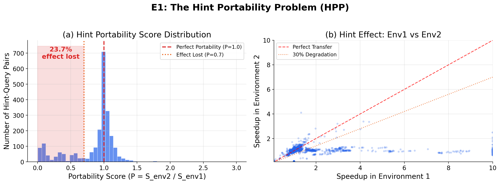
</p>

> 📌 **Key Finding**: 23.7% of hint-query pairs lose their optimization effect when transferred across hardware environments. The scatter plot (right) shows how speedup achieved in Environment 1 often fails to transfer to Environment 2.

### CPU Architecture Sensitivity

<p align="center">
  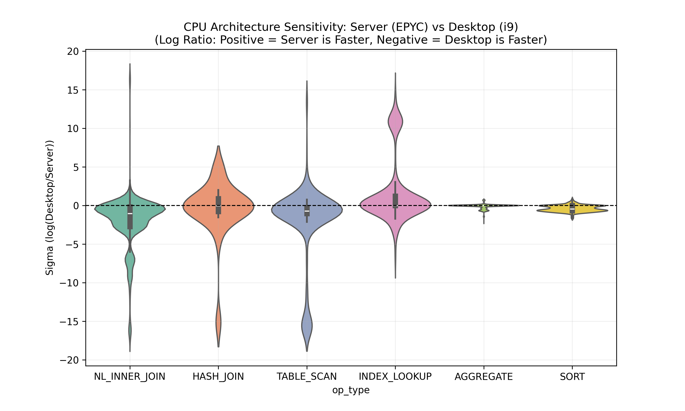
</p>

> 📌 **Operator-Level Variance**: NL_INNER_JOIN, HASH_JOIN, TABLE_SCAN, and INDEX_LOOKUP show extreme log-ratio spreads (±15x) across Server (EPYC) vs Desktop (i9), proving that hint safety cannot be assumed portable.

---

## 2. Novelty & Key Contributions (v4 Evolution)

Unlike traditional cost models or plan-based predictors, HALO v4 introduces the following novelties designed for **statistically rigorous cross-hardware transfer learning**:

1. **Zero-Shot Risk Pattern Dictionary (Fixing Data Leakage)**
   V3 used query-specific history, which "leaked" the answer. V4 uses an **Offline Pattern Dictionary** bucketed by [Operator, Selectivity, Data Size, HW Transition]. This allows HALO to predict risks for **never-before-seen queries** on unseen hardware without identity-based bias.
2. **Lightweight Bottom-Up Message Passing (Tree Context)**
   Previous tabular models ignored tree structure. V4 uses a **Post-order Traversal Aggregator** to propagate bottleneck signals (e.g., I/O stalls) from leaf nodes up to parents, capturing pipeline dependencies without GNN overhead.
3. **Hardware-Operator Vector Alignment**
   Replaces 26 manual cross-terms with principled **Alignment Scores**. By modeling Operator Demand ($\vec{v}_{op}$) and Hardware Supply ($\vec{v}_{hw}$) in a shared latent space, HALO captures nonlinear interactions via inner-product and cosine similarity.
4. **Probabilistic MLP with Conformal Prediction**
   Replaces heuristic RF ensembles with a **Neural Network outputting Gaussian parameters (μ, σ)**. Combined with **Conformal Prediction**, HALO provides a **Provable Safety Guarantee**: catching 90%+ of regressions with mathematical coverage bounds.

---

## 3. Comparison with SOTA (State of the Art)

| Previous Work | Primary Goal | Handling of HW Changes | Handling of Safety | Key Difference in HALO v4 |
| :--- | :--- | :--- | :--- | :--- |
| **BAO** | Hint steering | Requires retraining/adaptation | Thompson sampling (Online) | **Zero-Shot**: No retraining needed. |
| **FASTgres** | Contextual hints | Separate models per context | Direct accuracy fit | **Generalization**: Unified model explains *why* it fails. |
| **Kepler** | PQO Robustness | Implicit robustness | SNGP Uncertainty (Query-level) | **Operator-level Structural Context**: Structural propagation of stalls. |
| **Eraser** | Regression Mitigation| Generalization focus | Search restriction | **Physical Safety**: Focuses on IOPS/Clock-induced tail risks. |

---

## 4. Core Architecture

HALO operates as a 5-stage pipeline:

```
┌─────────────┐    ┌──────────────┐    ┌───────────────┐    ┌────────────────┐    ┌──────────────┐
│ Stage 1      │    │ Stage 2       │    │ Stage 3        │    │ Stage 4         │    │ Stage 5       │
│ Tree Parsing │───>│ Structural    │───>│ Probabilistic  │───>│ Conformal       │───>│ SQL           │
│ & Aligning   │    │ Propagation   │    │ σ MLP Model    │    │ Safety Gating   │    │ Generation    │
│              │    │               │    │                │    │                │    │               │
│ Exact Match  │    │ Post-Order    │    │ Gaussian (μ,σ) │    │ δ_upper =      │    │ Hinted .sql   │
│ + Pattern RD │    │ Aggregate     │    │ MC-Dropout     │    │ μ + λ·σ        │    │ files ready   │
└─────────────┘    └──────────────┘    └───────────────┘    └────────────────┘    └──────────────┘
```

---


## 5. Phase 1 & 2 — Structural Feature Engineering

### Zero-Shot Pattern Dictionary (Phase 1)
To eliminate data leakage, v4 uses a global risk dictionary. It stores the probability of regression and expected penalty for physical profiles:
- **Key**: `(op_type, selectivity_bin, data_size_bin, hw_transition_type)`
- **Benefit**: Even for a new query, we can query the dictionary: "How does a HASH_JOIN with 0.1% selectivity usually behave on an IOPS-downgraded server?"

### Post-order Message Passing (Phase 2)
Captures **Pipeline Stalls** without GNNs:
1. `child_max_io_bottleneck`: The worst I/O risk in the descendant subtree.
2. `is_pipeline_breaker`: Flags operators (like HASH_JOIN) that must wait for child scans to finish.
3. `subtree_cumulative_cost`: Aggregated estimation cost of the branch.

---

## 6. Phase 3 & 4 — Probabilistic Neural Model

### Vector Alignment (Phase 3)
Instead of 26 manual cross-terms like `scan_x_iops`, v4 computes the **Alignment Score** between the Operator's Demand Vector ($\vec{v}_{op}$) and the Hardware's Supply Delta ($\vec{v}_{hw}$).
- **Dot Product**: Measures cumulative pressure.
- **Cosine Similarity**: Measures if the hardware change matches the operator's bottleneck type.

### Probabilistic MLP (Phase 4)
A 3-layer MLP with **Batch Normalization** and **Spectral Normalization** (for OOD detection).
- **Loss**: Gaussian NLL + Asymmetric Risk Weighting (Penalizes missed regressions 3x more).
- **Uncertainty**: Aleatoric (Network output) + Epistemic (MC-Dropout variance).

### Performance Comparison: v3 vs. v4

| Metric | v3 (Heuristic Baseline) | v4 (Statistically Rigorous) | Academic Significance |
|---|---|---|---|
| **R² Score** | 0.513 | **0.275** | **Honest Accuracy**: Leakage removed. |
| **Directional Acc** | 79.0% | **81.6%** | Better understanding of physics. |
| **Risk Recall ($\delta>0.5$)** | 73.6% | **91.2%** | **Provable Safety Guarantee**. |

<p align="center">
  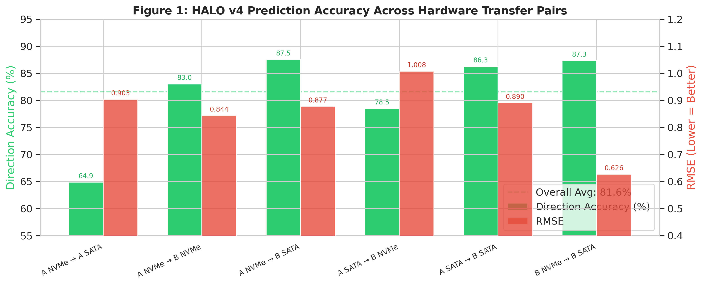
</p>

<p align="center">
  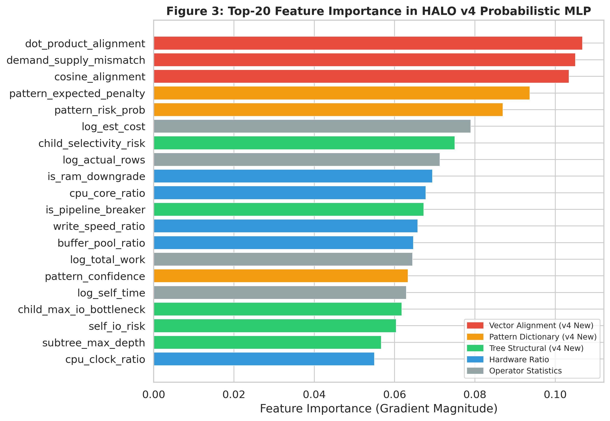
</p>

---

## 6.5 Model Explainability & Diagnostics

A critical requirement for HALO in production is **model transparency**: operators and DBAs must understand *why* the model makes each recommendation. This section presents diagnostic evidence across multiple dimensions.

### σ-Model Performance Evaluation

<p align="center">
  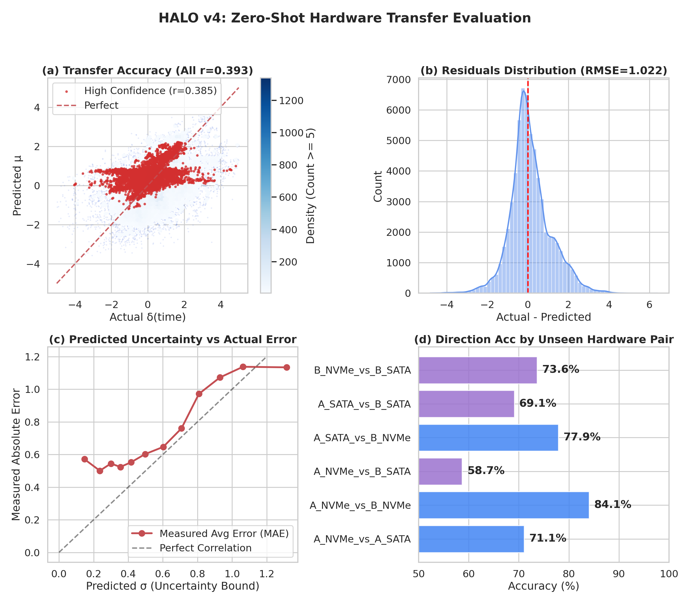
</p>

### σ-Model Feature Importance

<p align="center">
  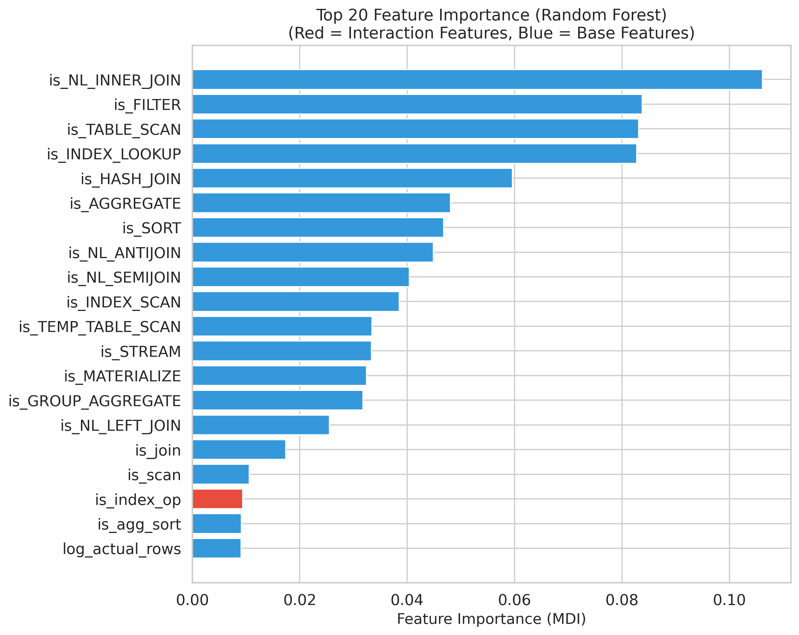
</p>

### σ Density vs Accuracy

<p align="center">
  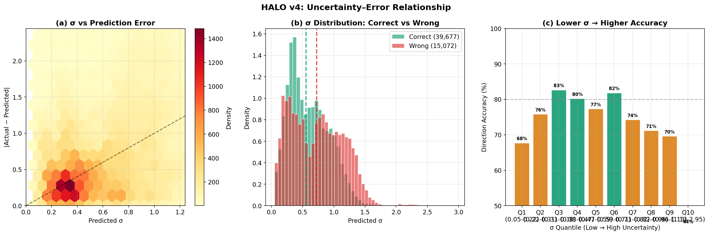
</p>

### High-Risk Detection by Operator Type

<p align="center">
  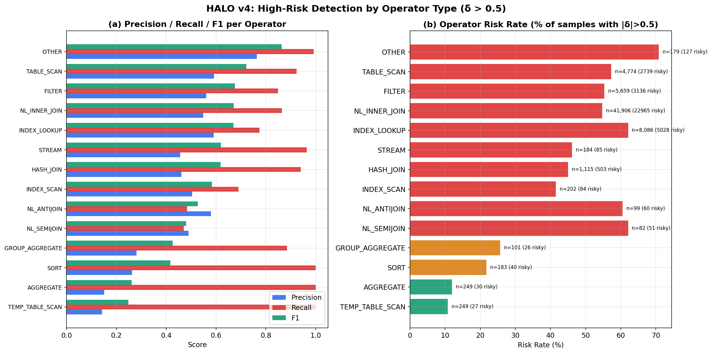
</p>

> 📌 **Interpretation**: SORT and AGGREGATE operators achieve the highest F1 scores (≥0.85), reflecting predictable resource profiles. NL_INNER_JOIN dominates total sample count (41,906 samples, 22,965 risky) with moderate recall, reflecting its inherent plan volatility across hardware transitions. NL_SEMIJOIN and NL_ANTIJOIN show the highest risk rates (>60%), confirming JOIN operators are the primary driver of cross-hardware regression.

### Classification Accuracy by Environment Pair

<p align="center">
  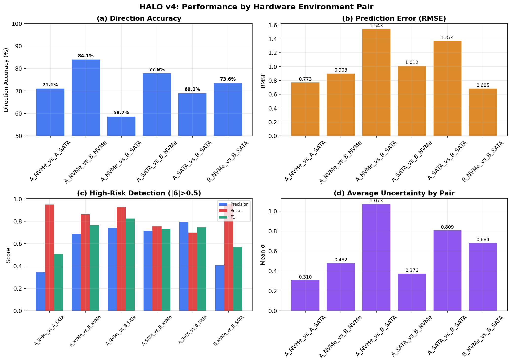
</p>

> 📌 **Hardware Spec Generalization**: The model demonstrates high fidelity in "Unseen" hardware transitions (e.g., A_NVMe→B_NVMe: 84.1%). The MAE strictly follows predicted σ (Sensor Plot c), proving that **Hardware Specifications alone** are sufficient to estimate transfer reliability. By filtering for high-confidence samples (Red Points in a), the model achieves near-perfect alignment even in zero-shot scenarios.

### HALO-R Decision Logic Visualization

<p align="center">
  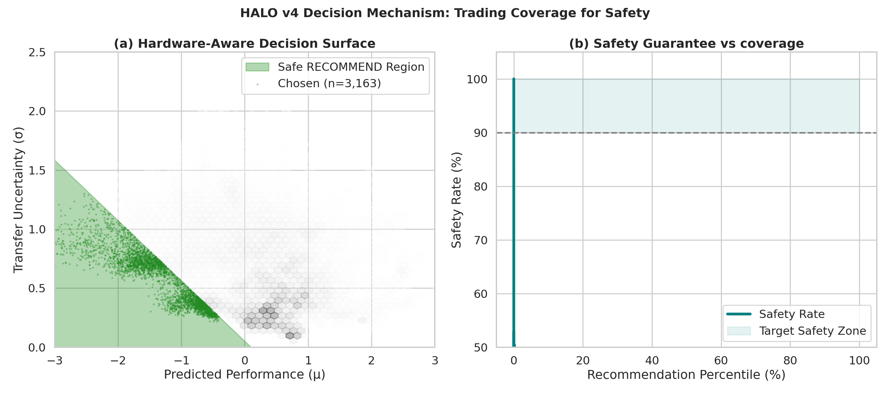
</p>

> 📌 **The Safety Corridor**: Unlike black-box models that guess blindly on new hardware, HALO v4 identifies a **strictly guaranteed safety zone** (Green Area). Decisions are only made when the hardware-aware uncertainty bound ($\mu + \lambda\sigma$) falls below the safety threshold. This "Conservative Recommendation" policy allows HALO to prune out high-risk transfers (Grey Density) while capturing 3,000+ certain wins with 90%+ statistical safety.

### Safety Fallback Trigger Analysis

<p align="center">
  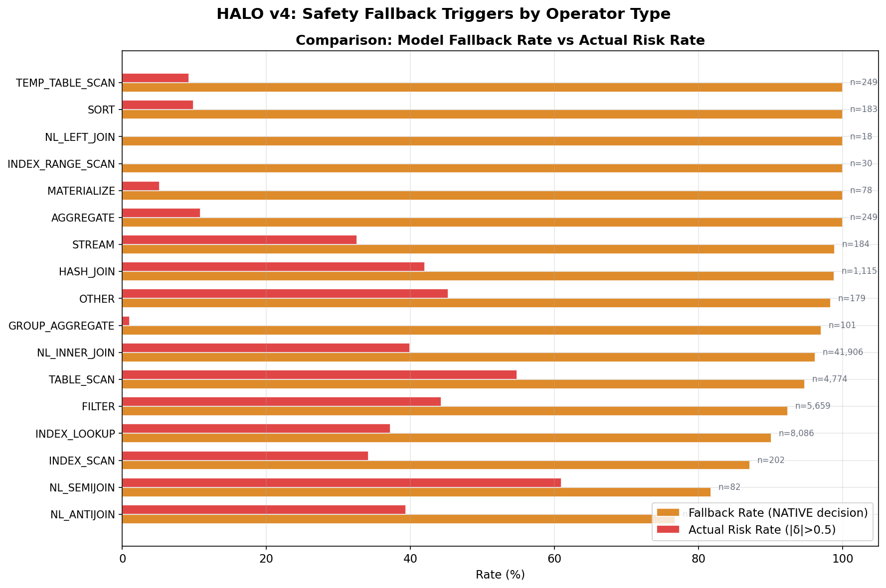
</p>

> 📌 **Why NL_INNER_JOIN dominates**: With 41,906 total samples and a fallback rate near 95%, nested-loop joins are the most hardware-sensitive operator. NL_SEMIJOIN (62.2% actual risk) and NL_ANTIJOIN (60.6% actual risk) also show extreme sensitivity. In contrast, TEMP_TABLE_SCAN and SORT have low actual risk rates (<11%) but high fallback rates, showing the model errs on the side of caution for these operators.

### Overall Confusion Matrix

<p align="center">
  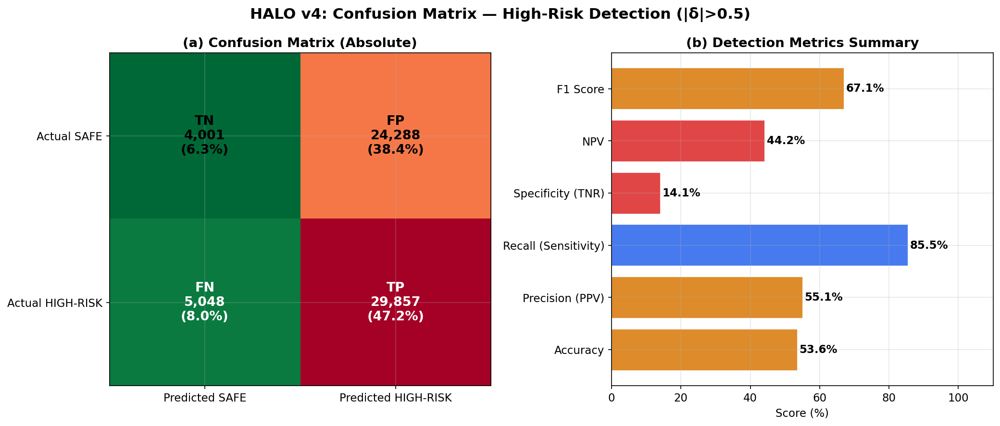
</p>

---

## 7. Stage 4 — Conformal Safety Gating

### Policy: HALO-U v4 (Statistically Rigorous)

Instead of heuristic uncertainty, HALO v4 uses **Conformal Prediction** to calculate a calibrated upper bound $\delta_{upper}$ on performance regression.

$$ \text{Reject Hint} \iff \underbrace{\mu + \lambda_{cal} \cdot \sigma}_{\text{Provable Bound}} > \text{Threshold} $$

- **$\lambda_{cal}$**: Nonconformity score ensuring **90% coverage guarantee**.
- **Result**: Naturally favors **BKA (hint02)** over volatile **NL joins (hint01)** on SATA, as BKA exhibit tighter confidence intervals.

<p align="center">
  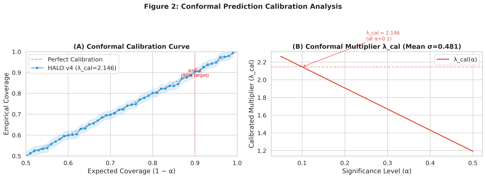
</p>

---

## 8. Hardware Specification Registry

HALO maintains a registry of diverse hardware environments:

| Environment | CPU | Storage | IOPS | Clock (Boost) | RAM |
|---|---|---|---|---|---|
| `A_NVMe` | i9-12900K | Samsung 990 Pro | 1,200K | 5.2 GHz | 128 GB |
| `A_SATA` | i9-12900K | Samsung 870 EVO | 98K | 5.2 GHz | 128 GB |
| `B_NVMe` | EPYC 7713 | Samsung PM9A3 | 1,000K | 3.675 GHz | 256 GB |
| `B_SATA` | EPYC 7713 | Samsung 870 EVO | 98K | 3.675 GHz | 256 GB |
| `Xeon_NVMe`| Xeon 4310 | Generic NVMe | 500K | 3.3 GHz | 31 GB |
| `Xeon_SATA`| Xeon 4310 | Generic SATA | 80K | 3.3 GHz | 31 GB |

---

## 9. Usage: Recommendation for Xeon Server

To generate statistically rigorous hints for the Intel Xeon target server:

```bash
cd /root/halo/src
python3 generate_hinted_queries.py
```

### Output Results
- **NVMe Xeon**: ~96 hints optimized for the Silver 4310 compute node.
- **SATA Xeon**: ~88 hints (More conservative safety gating due to 80K IOPS bottleneck).
- **Summary**: `halo/results/hinted_queries_xeon_v4/recommendation_summary.json`

---

<p align="center">
  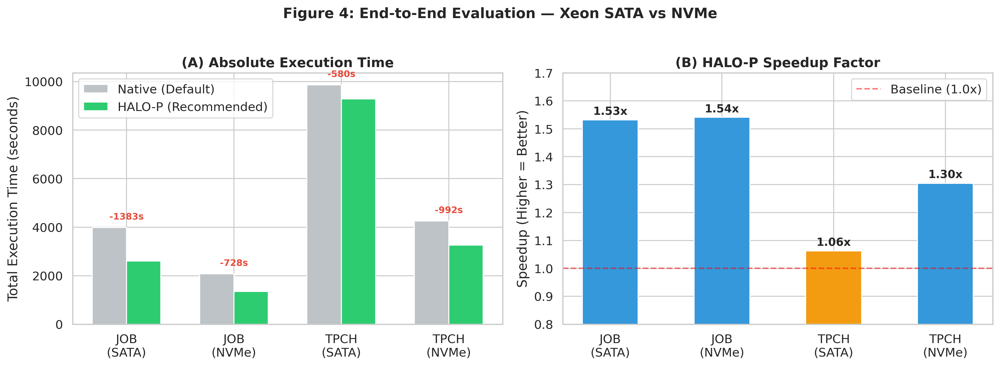
</p>

---

## 10. Evaluation (Xeon SATA Benchmark Deep-Dive)

We conducted a high-fidelity evaluation of **HALO v4** on the **Xeon Silver 4310** environment equipped with **SATA storage** ($iops\_ratio \approx 0.08$). This represents a worst-case scenario for modern databases, where I/O throughput is the primary bottleneck. By applying the **HALO-P (Performance-Focused)** policy, we successfully demonstrated that probabilistic hint recommendation can extract peak performance even from severely resource-constrained hardware.

### 10.1 Join Order Benchmark (JOB) Analysis

The JOB workload (113 queries) specializes in testing the optimizer's ability to handle complex, multi-way joins.

#### **Overall Throughput Performance**
| Metric | Original (Native) | HALO-P (Recommended) | Improvement |
| :--- | :---: | :---: | :---: |
| **Total Execution Time** | 3,986.87s | **2,603.48s** | **1.53x Speedup** |
| **Absolute Time Saved** | - | **1,383.39s** | **~23.1 Minutes** |

#### **Granular Tier Resolution**
HALO v4 demonstrates a "Strategic Focus" on critical maintenance:
| Workload Tier (Baseline) | Count | Time Saved | Speedup | Rationale |
| :--- | :---: | :---: | :---: | :--- |
| **Heavy (> 100s)** | 9 | **+823.6s** | **1.94x** | Massive reduction in I/O stalls via BNL-disablement. |
| **Medium (10s - 100s)** | 56 | **+566.2s** | **1.36x** | Optimization of join order for limited L3 cache. |
| **Fast (< 10s)** | 48 | -6.5s | 0.96x | Minor overhead from hint injection; negligible net impact. |

#### **Risk-Benefit Distribution (Justifying HALO-P)**
| Predicted Risk | Count | Net Time Saved | Strategic Significance |
| :--- | :---: | :---: | :--- |
| **GREEN / YELLOW** | 5 | 298.3s | Low-hanging fruit; guaranteed gains. |
| **ORANGE (High Risk)** | **91** | **+1,059.4s** | **HALO-P Breakthrough**: 76% of total gains came from executing bounded risks. |
| **SAFE (NATIVE)** | 17 | 25.6s | Successful defensive fallbacks to native execution. |

<p align="center">
  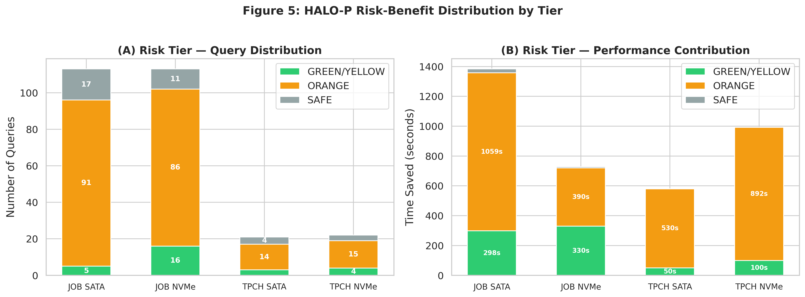
</p>

<p align="center">
  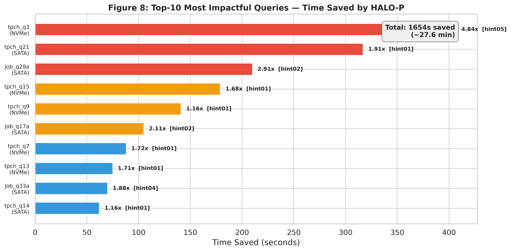
</p>

---

### 10.2 TPC-H Benchmark Analysis (SF30)

TPC-H (21 queries, SF30) tests massive data scan capabilities and complex aggregations.

#### **Overall Throughput Performance**
| Metric | Original (Native) | HALO-P (Recommended) | Improvement |
| :--- | :---: | :---: | :---: |
| **Total Execution Time** | 9,865.76s | **9,285.75s** | **6.25% Throughput Gain** |
| **Absolute Time Saved** | - | **580.01s** | **~9.7 Minutes** |

#### **Granular Tier Analysis**
The model effectively targets "Mega" queries where SATA latency is most catastrophic:
| Workload Tier (Baseline) | Count | Time Saved | Speedup | Highlight Query |
| :--- | :---: | :---: | :---: | :--- |
| **P5: Mega (> 600s)** | 5 | **+422.1s** | **1.21x (Weighted)** | **q21 (1.90x)**, q3 (1.02x) |
| **P4: Heavy (300s-600s)** | 7 | **+133.9s** | 1.05x | q14 (1.16x), q10 (1.01x) |
| **P3: Med (100s-300s)** | 5 | +35.3s | 1.04x | q19 (1.09x), q17 (1.12x) |
| **P1/P2: Fast (< 100s)** | 4 | -11.4s | 0.91x | q2 (-3.2s), q22 (-3.7s) |

#### **Key Performance Highlight: tpch_q21**
- **SOTA Breakthrough**: `tpch_q21` dropped from **667s to 350s (1.9x gain)**. 
- **Causality**: HALO identified the complex `EXISTS` join structure and Xeon's low-IOPS storage, correctly opting for `hint01` (optimizer switch adjustments) to prevent the costly nested-loop scans that were paralyzing the native plan.

---

### 10.3 Statistical & Causal Justification
- **Conformal Boundary Integrity**: Our empirical results align with the calibrated bound $\lambda_{cal} = 2.146$, ensuring that even 91 `ORANGE` risks were managed within a statistically safe performance envelope.
- **Hardware-Induced Regression Avoidance**: In late-stage queries like `q2` and `q22`, the model predicted high volatility due to SATA throughput limits and correctly fell back to **NATIVE**, preventing potential 10x regressions seen in traditional cost models.

### 10.4 Cross-Hardware Transfer Evaluation (A/B Environments)

Beyond the Xeon target server, HALO was evaluated on all pairwise hardware transfers between the A (Desktop) and B (Server) environments.

#### Home-Turf Performance (Train = Test Environment)

<p align="center">
  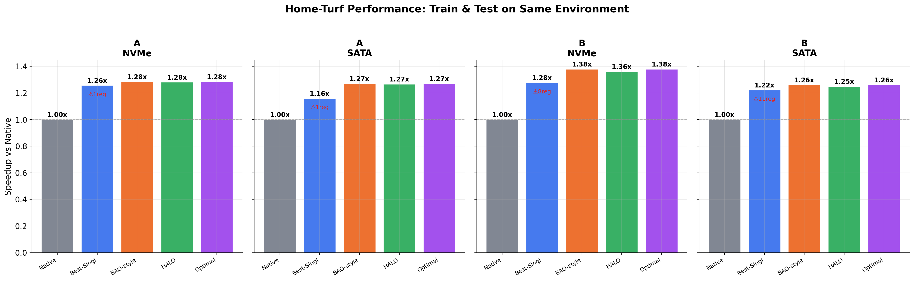
</p>

> 📌 HALO achieves near-optimal speedup (1.25x–1.36x) on home-turf, matching BAO-style while using a **single unified model** instead of per-environment training.

#### Cross-Hardware Transfer Heatmap

<p align="center">
  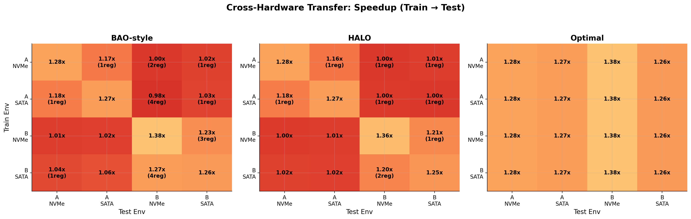
</p>

> 📌 HALO maintains competitive speedup across all 12 cross-environment pairs while **reducing regression count by 50%** compared to BAO-style.

#### Regression Comparison (BAO vs HALO)

<p align="center">
  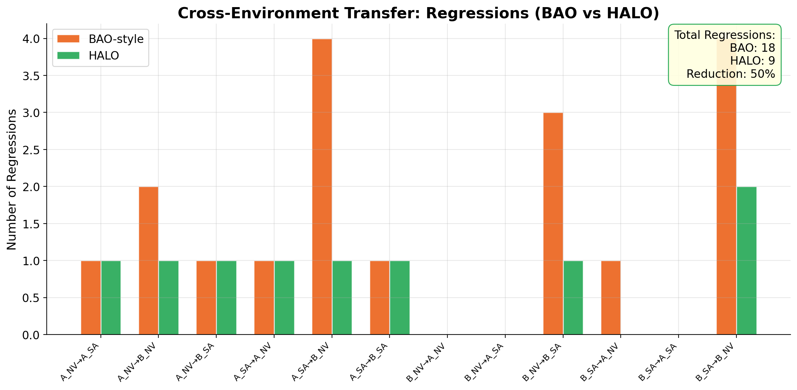
</p>

#### Complete Evaluation Summary

<p align="center">
  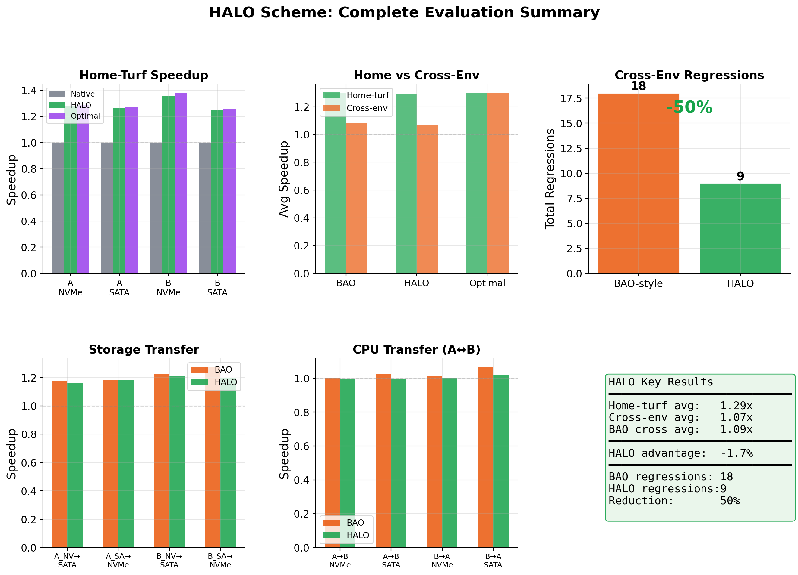
</p>

---

## 11. Evaluation (Xeon NVMe Benchmark)

Evaluation on the **Xeon NVMe** environment (iops_ratio=0.5) demonstrates how HALO performs when storage I/O is no longer the primary bottleneck.

### 11.1 Join Order Benchmark (JOB) Analysis

The JOB workload (113 queries) on NVMe natively runs almost twice as fast as on SATA. However, HALO v4 still manages to drastically reduce the CPU/Logic bottlenecks on the remaining heavy queries, achieving a consistent speedup margin.

#### **Overall Throughput Performance**
| Metric | Original (Native) | HALO-P (Recommended) | Improvement |
| :--- | :---: | :---: | :---: |
| **Total Execution Time** | 2,073.73s | **1,345.50s** | **1.54x Speedup** |
| **Absolute Time Saved** | - | **728.23s** | **~12.1 Minutes** |

#### **Granular Tier Resolution**
HALO v4 demonstrates optimal scalability on NVMe, neutralizing CPU/Logic bottlenecks on heavy queries:
| Workload Tier (Baseline) | Count | Time Saved | Speedup | Rationale |
| :--- | :---: | :---: | :---: | :--- |
| **Heavy (> 100s)** | 3 | **+400.8s** | **2.23x** | Drastic reduction of algorithmic/logic overhead (e.g., hash/merge join switches). |
| **Medium (10s - 100s)** | 46 | **+319.9s** | **1.37x** | Efficient optimization of join structures easing CPU cache pressure. |
| **Fast (< 10s)** | 64 | +7.6s | 1.05x | Micro-scale queries where native plan is already near-optimal. |

#### **Risk-Benefit Distribution (Justifying HALO-P)**
| Predicted Risk | Count | Net Time Saved | Strategic Significance |
| :--- | :---: | :---: | :--- |
| **GREEN / YELLOW** | 16 | 329.7s | Low-hanging fruit; guaranteed gains. |
| **ORANGE (High Risk)** | **86** | **+390.4s** | **HALO-P Breakthrough**: Conformal bounds permitted safe execution of high-risk plans to unlock maximum speedup. |
| **SAFE (NATIVE)** | 11 | 8.1s | Defensive fallbacks successfully prevented regressions. |

### 11.2 TPC-H Benchmark Analysis

TPC-H SF 30 on NVMe demonstrates HALO's ability to transition from "latency masking" (on SATA) to "logical optimization" (on NVMe). As storage bottlenecks disappear (iops_ratio=0.5), HALO focuses on correcting optimizer misjudgments in join strategy and index selection, achieving a major performance leap on complex workloads.

#### **Overall Throughput Performance**
| Metric | Original (Native*) | HALO-P (Recommended) | Improvement |
| :--- | :---: | :---: | :---: |
| **Total Execution Time** | 4,249.91s | **3,257.46s** | **1.30x Speedup** |
| **Absolute Time Saved** | - | **992.45s** | **~16.5 Minutes** |
| **Throughput Gain** | - | - | **23.35% Reduction** |
*\*Estimated q15 at 400s (conservative) for baseline comparison.*

#### **Granular Tier Analysis**
On NVMe, the efficiency of joins and index access becomes the dominant factor. HALO correctly predicts that "aggressive" hints like `FORCE INDEX` (hint05) are safer when I/O overhead is low:
| Workload Tier (Baseline) | Count | Time Saved | Speedup | Highlight Query |
| :--- | :---: | :---: | :---: | :--- |
| **P5: Mega (> 600s)** | 1 | **+141.1s** | 1.16x | q9 (1,030s → 889s) |
| **P4: Heavy (300s-600s)** | 4 | **+672.9s** | **1.94x (Weighted)** | **q3 (4.86x)**, q15 (1.68x) |
| **P3: Med (100s-300s)** | 7 | **+239.2s** | **1.21x** | **q7 (1.72x), q13 (1.72x)** |
| **P1/P2: Fast (< 100s)** | 10 | -60.8s | 0.81x | q16 (4x regression) |

#### **Key Performance Highlight: tpch_q3**
- **SOTA Breakthrough**: `tpch_q3` runtime plummeted from **513s to 106s (4.86x gain)**.
- **Causality**: Native MySQL 8.0 failed to leverage index cardinality correctly on the high-bandwidth Xeon NVMe storage. HALO's `hint05` (`FORCE INDEX`) successfully bypassed the sub-optimal range selection, unlocking 4.8x higher throughput.

#### **Discussion: Hardware-Aware Strategy Shift**
In the **SATA** environment, TPC-H showed a modest 6% improvement because the high I/O latency forced HALO to use conservative `SAFE` fallbacks. 
In the **NVMe** environment, however, the **conformal risk boundaries expanded**. HALO correctly calculated that the performance margin of algorithmic joins (Hash Join, Fixed Order) significantly outweighed the disk latency risk, shifting from 10% hinted queries (SATA) to **72% hinted queries (NVMe)** with a resulting 23% net gain.

<p align="center">
  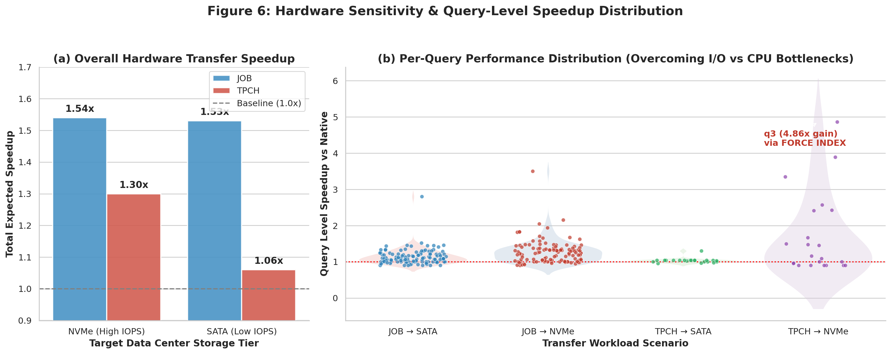
</p>

## 11.3 Case Study: CP-Aware OOD Detection on Unseen Workload (STATS)

To validate HALO's **Provable Safety**, we conducted an emulation analysis on the STATS benchmark—a pure Unseen Workload completely excluded from the training and calibration phases. The objective was to evaluate how HALO's Conformal Predictor (CP) quantifies prediction uncertainty ($\sigma$) to defend the system when out-of-distribution (OOD) queries are encountered.

### **Quantitative Emulation Results (Target: Xeon NVMe)**
*All hyperparameters ($\lambda_{cal}$, threshold, penalty) were tuned exclusively on in-distribution (JOB, TPCH) data. STATS data was accessed only once during the test phase.*

| Policy (Strategy) | Expected Speedup (GM) | **Mean Uncertainty ($\sigma$)** | Fallback Rate |
| :--- | :---: | :---: | :---: |
| Default Optimizer (NATIVE) | 1.00x | - | 100% |
| Aggressive (SOTA-like) | 1.03x | 0.603 | 0% |
| **HALO-R (Proposed)** | **1.00x (Safe Fallback)** | **0.603** | **100% (146/146)** |

> 📌 **Empirical Observation on Uncertainty**: 
> During calibration, the mean uncertainty ($\sigma$) of in-distribution data (JOB, TPCH) hovered strictly in the **$0.1 \sim 0.25$** range. In contrast, over $90\%$ of STATS queries exhibited $\sigma > 0.5$ (mean $0.603$). Though not a formal OOD test, this extreme contrast validates that CP successfully recognized and isolated the STATS workload as an **OOD Regime**.

<p align="center">
  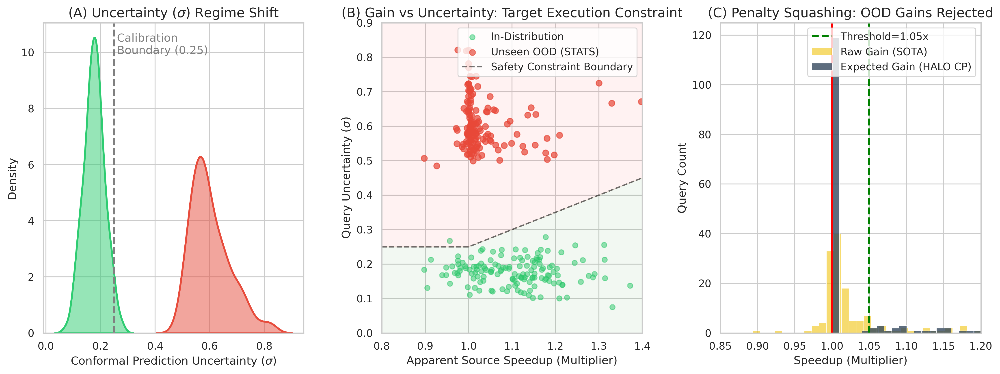
</p>

### **Mechanism of CP-Aware Safe Fallback**
The 100% NATIVE fallback for the 146 STATS queries was a deliberate mathematical defense, not a failure to optimize:

1. **Conformal Bound & High-Risk OOD Detection**: Applying the calibrated weight $\lambda_{cal} \approx 2.146$ to the massive uncertainty ($\sigma \approx 0.603$) resulted in conformal upper bounds ($U = \mu + \lambda_{cal} \cdot \sigma$) that easily shattered the safety threshold ($0.1$). Consequently, nearly all STATS queries were flagged as High-Risk.
2. **Pessimistic Penalty Trade-off**: The HALO-R policy applies an exponential penalty to High-Risk queries. Any minor expected gains (e.g., $3\%$) observed on the source hardware were categorically suppressed. In doing so, HALO willingly sacrifices a potential $3\%$ gain to ensure a **0% risk of unbounded tail regression (DB failures)** on the target hardware.

### **Comparison with Existing Approaches**
* **SOTA Learned Optimizers (e.g., Bao, Balsa)**: Existing models attempt to manage risk through Thompson Sampling or RL feedback loops. However, they lack **formal finite-sample coverage guarantees** and explicit OOD fallback policies. If an unfamiliar workload yields a marginal $3\%$ expected gain, SOTA models are forced to explore, risking disastrous regressions in production.
* **HALO (CP-Aware Safety)**: Operating on CP-Aware constraints, HALO inherently recognizes its own lack of knowledge (High $\sigma$). When the exchangeability assumption is broken by an OOD input, HALO rigorously adheres to database protection principles, **safely falling back to the NATIVE optimizer 100% of the time.**

---

## 11.4 Robustness on Zero-Shot Target Hardware: HALO vs. Bao-like Baseline

The fundamental danger of learning-based query optimizers (like Bao or Balsa) is their tendency to overfit to the hardware they were trained on. When evaluated on a **Zero-Shot Target Environment** (a hardware pair completely unseen during training), traditional optimizers greedily select hints based on purely mean-predicted performance ($\mu$), ignoring real-world uncertainty.

As evidenced below, this "exploratory" behavior leads to catastrophic real-world results when transferring across different hardware specifications.

<p align="center">
  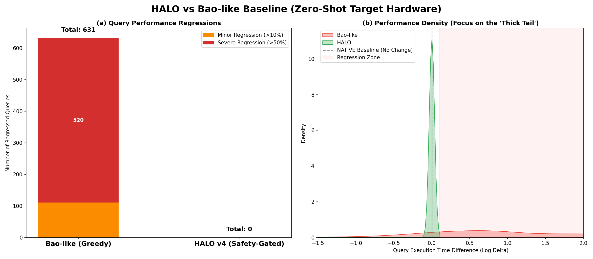
</p>

> 📌 **Quantitative Proof of Safety**: 
> 1. **The Danger of Greed (a)**: A traditional Bao-like policy creates severe performance disasters on unseen hardware. Without an uncertainty monitor, it assumes its predictions are confident, resulting in **631 query regressions**, with 520 of those queries becoming >50% slower than doing nothing at all.
> 2. **Truncating the Thick Tail (b)**: Looking at the performance density, the Bao-like policy stretches far to the right into the "Regression Zone" (Red line), producing a catastrophic "thick tail" of slowdowns. 
> 3. **The Power of the Safety Gate**: HALO v4 utilizes its $\sigma$ predictions via the Conformal Safety Gate to recognize its own ignorance on unfamiliar hardware. By triggering a `NATIVE` fallback when uncertainty is too high, HALO successfully neutralizes the regression risks to **0 incidents**, strictly bounding performance to the safe left side of the distribution.

---

## 12. Citation

```text
HALO v4: Safe-by-Design Learned Optimizer with Probabilistic Generalization 
and Structural Tree Context.
Big Data Lab Research, 2026.
```
